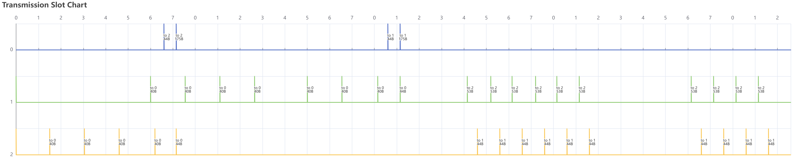

# Deterix: Deterministic Network Emulator with Microsecond Timing Precision

Deterix is a lightweight communication framework designed specifically for modular digital twins requiring deterministic data exchange. Built on PREEMPT_RT Linux, it achieves microsecond-precision timing on commodity hardware through pure software implementation, enabling reliable real-time communication between digital twin components without requiring specialized hardware. The framework leverages standard Commercial Off-The-Shelf (COTS) computers and regular network infrastructure, making it an accessible solution for distributed digital twin deployments.

## Features

- Time-slotted communication (TDMA)
- Guaranteed message delivery windows
- Microsecond timing precision of [slot ticker](https://github.com/AmyangXYZ/rt_ticker)
- No GC interruptions
- Zero-copy packet handling
- Distributed architecture
- Runs on any modern COTS hardware

## Network Architecture

### Overview

The network operates on a Time Division Multiple Access (TDMA) protocol with Node 0 serving as the network orchestrator. Key architectural features include:

- Distributed time synchronization with <1µs precision
- Deterministic slot-based communication
- Dynamic network formation and management

### Slot Structure

```
|<------------------------ SLOTFRAME (8 slots) ------------------------>|
+--------+--------+--------+--------+--------+--------+--------+--------+
| Slot 0 | Slot 1 | Slot 2 | Slot 3 | Slot 4 | Slot 5 | Slot 6 | Slot 7 |
| IDLE   | DEDIC  | DEDIC  | DEDIC  | SHARED | SHARED | SHARED | SHARED |
| -/-    | 1/2    | 2/3    | 3/1    | */0    | */0    | 0/*    | */0    |
+--------+--------+--------+--------+--------+--------+--------+--------+


|<----------------------------- Single Slot ----------------------------->|
+-------+-----------------------------------+---------------------+-------+
| CLEAR |               TX/RX               |         ACK         | GUARD |
|  10%  |                50%                |         30%         |  10%  |
+-------+-----------------------------------+---------------------+-------+
```

Example transmission-slot chart showing two nodes join and synchronize with orchestrator and send 10 data packets in their dedicate slots.



### Time Synchronization

- **Node 0 (Orchestrator)**

  - Provides network-wide time reference using system clock
  - Manages slot timing and synchronization
  - Broadcasts periodic sync messages

- **Other Nodes**
  - Maintain synchronized local clocks
  - Update timing based on sync messages
  - Calculate slot boundaries locally

## Network Operations

### Network Formation

1. **Initialization Phase**

   - Node 0 starts as orchestrator
   - Dedicated join slots are reserved in each slotframe
   - New nodes begin in unsynchronized state

2. **Join Process**
   ```
   New Node                  Node 0 (Orchestrator)
      |                              |
      |------ Join Request --------->| (in shared slot)
      |                              | - Records node and add schedule
      |                              | - Prepares timing info
      |<----- Join Response ---------|
      |                              |
      |- Synchronize local clock     |
      |- Start normal operation      |
   ```

### Communication Protocol

1. **Slot Assignment**

   - Deterministic sender/receiver pairs per slot
   - Scheduled transmission windows
   - Guard bands prevent overlap

2. **Transmission Process**
   - Reliable delivery with ACK mechanism
   - Automatic retransmission
   - Sequence number tracking

### Implementation Details

- **Core Components**

  - TX/RX Queue Management
  - Slot Ticker System
  - Zero-copy Packet Pool
  - RT Thread Scheduling

- **Performance Features**
  - Thread affinity optimization
  - RT scheduler prioritization
  - Efficient buffer management
  - Microsecond-precision timing

## LICENSE

GPL-3.0
